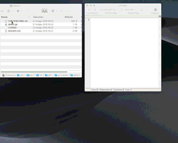

# About

Simple  script for Apple Automator: connects all selected text files in Apple Finder as one text and copy their content to clipboard.

### Installation 

Just clone this repo and double-click on downloaded filename **source/Copy selected files content to clipboard as TEXT**  after download and click the install button.

### Example

